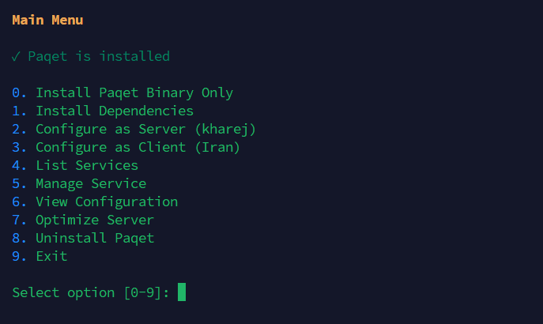

# Paqet-Tunnel-Manager

اسکریپت مدیریتی برای **paqet**: یک تونل مبتنی بر Raw Socket و KCP که برای عبور از فایروال و DPI طراحی شده است. این اسکریپت از سناریوی **سرور خارج (Kharej)** و **کلاینت ایران (Entry Point)** پشتیبانی می‌کند.

---

## فهرست مطالب

* [شروع سریع](#شروع-سریع)
* [مراحل نصب](#مراحل-نصب)

  * [مرحله ۱: راه‌اندازی سرور خارج (Kharej – VPN Server)](#مرحله-۱-راهاندازی-سرور-خارج-kharej--vpn-server)
  * [مرحله ۲: راه‌اندازی سرور ایران (Iran – Client/Entry Point)](#مرحله-۲-راهاندازی-سرور-ایران-iran--cliententry-point)
* [تنظیمات پیشرفته (حالت‌های KCP)](#تنظیمات-پیشرفته-حالتهای-kcp)
* [بهینه‌سازی شبکه (اختیاری)](#بهینهسازی-شبکه-اختیاری)
* [ابزارهای استفاده‌شده](#ابزارهای-استفادهشده)
* [عیب‌یابی: مشکلات نصب Paqet](#عیبیابی-مشکلات-نصب-paqet)
* [نیاز به کمک؟](#️-نیاز-به-کمک)
* [پیش‌نیازها](#پیشنیازها)
* [تصائیر اسکریپت](#-تصاویر-اسکریپت)
* [لایسنس](#لایسنس)
* [قدردانی](#قدردانی)

---

## شروع سریع

اسکریپت را روی **هر دو سرور** و با دسترسی **root** اجرا کنید:

```bash
bash <(curl -fsSL https://raw.githubusercontent.com/behzadea12/Paqet-Tunnel-Manager/main/paqet-manager.sh)
```

سپس **گزینه 0** و بعد **گزینه 1** را برای نصب پیش‌نیازها انتخاب کنید.

---

## مراحل نصب

### مرحله ۱: راه‌اندازی سرور خارج (Kharej – VPN Server)

اسکریپت را اجرا کنید:

```bash
bash <(curl -fsSL https://raw.githubusercontent.com/behzadea12/Paqet-Tunnel-Manager/main/paqet-manager.sh)
```

#### مراحل پیکربندی

1. **گزینه 2** را انتخاب کنید (Kharej)
2. **یک نام دلخواه** برای سرویس/تونل وارد کنید (مثال: `fanland1`)
3. **پورت Listen** را وارد کنید (مثال: `443` یا `8443`)
4. برای ساخت خودکار **Secret Key**، **Enter** بزنید
5. **کلید ساخته‌شده را ذخیره کنید** سپس **`Y`** را برای تأیید بزنید
6. **حالت KCP** را انتخاب کنید (پیشنهادی: گزینه `1` - fast)
7. **conn value** → تعداد اتصال‌های KCP (مثال: `4`)
8. **MTU** → مقدار پیش‌فرض `1350` (در صورت نیاز می‌توانید مثلاً `1200` وارد کنید)
9. **متد Encryption** را انتخاب کنید (پیش‌فرض: `aes-128-gcm`)
10. **pcap sockbuf** → برای مقدار پیش‌فرض **Enter** بزنید
11. **transport tcpbuf** → برای مقدار پیش‌فرض **Enter** بزنید
12. **transport udpbuf** → برای مقدار پیش‌فرض **Enter** بزنید
13. **پورت یا پورت‌های V2Ray** را وارد کنید
    تک پورت: `9090` — چند پورت: `9090,9091,9092`

---

### مرحله ۲: راه‌اندازی سرور ایران (Iran – Client/Entry Point)

#### مراحل پیکربندی

1. **گزینه 3** را انتخاب کنید (Iran)
2. **یک نام دلخواه** برای سرویس/تونل وارد کنید (مثال: `fanland`)
3. **آی‌پی سرور خارج** را وارد کنید (مثال: `65.109.206.29`)
4. **پورت سرور** (پورت ارتباطی بین دو سرور) را وارد کنید (مثال: `443`)
5. **کلید سکرت** که روی سرور خارج ساخته شده را وارد کنید
6. **حالت KCP** را انتخاب کنید (پیشنهادی: گزینه `1` - fast)
7. **conn value** → تعداد اتصال‌های KCP (پیش‌فرض: `1`)
8. **MTU** → مقدار پیش‌فرض `1350` (Enter بزن)
9. **متد Encryption** را انتخاب کنید (پیش‌فرض: `aes-128-gcm`)
10. **pcap sockbuf** → برای مقدار پیش‌فرض **Enter** بزنید
11. **transport tcpbuf** → برای مقدار پیش‌فرض **Enter** بزنید
12. **transport udpbuf** → برای مقدار پیش‌فرض **Enter** بزنید
13. **پورت یا پورت‌های Forward** را وارد کنید
    تک پورت: `333` — چند پورت: `333,394,395`
14. **برای هر پورت، پروتکل را انتخاب کنید**
    `1` tcp — `2` udp — `3` tcp/udp

---

## تنظیمات پیشرفته (حالت‌های KCP)

در **مرحله 8 (سرور خارج)** و **مرحله 9 (سرور ایران)** می‌توانید حالت‌های مختلف KCP را انتخاب کنید.

### حالت‌های KCP

0. **normal** – سرعت نرمال، تأخیر نرمال، مصرف منابع کم
1. **fast** – سرعت متعادل، تأخیر کم، مصرف منابع نرمال
2. **fast2** – سرعت بالا، تأخیر کمتر، مصرف منابع متوسط
3. **fast3** – حداکثر سرعت، تأخیر بسیار کم، مصرف CPU بالا
4. **manual** – تنظیمات پیشرفته به‌صورت دستی

> **پیشنهاد:**
> طبق بازخورد کاربرانی که از این اسکریپت استفاده کرده‌اند، **گزینه 1 (fast)** در اکثر شرایط بهترین عملکرد را دارد.
> اگر **سرور ایران شما محدودیت شبکه یا منابع** دارد، پیشنهاد می‌شود حالت‌های مختلف را تست کنید.
> در صورتی که **دانش فنی و تجربه کافی** دارید، می‌توانید از **manual** برای تنظیم دقیق همه پارامترها استفاده کنید.

---

## بهینه‌سازی شبکه (اختیاری)

اسکریپت را اجرا کنید:

```bash
bash <(curl -fsSL https://raw.githubusercontent.com/behzadea12/Paqet-Tunnel-Manager/main/paqet-manager.sh)
```

سپس **گزینه 7** را انتخاب کرده و یکی از موارد زیر را انتخاب کنید:

1. **BBR** – بهینه‌ساز کنترل ازدحام TCP *(پیشنهادی برای سرور خارج)*
2. **DNS Finder** – یافتن بهترین DNS برای ایران *(پیشنهادی برای سرور ایران)*
3. **Mirror Selector** – یافتن سریع‌ترین مخزن APT *(پیشنهادی برای سرور ایران)*

---

## ابزارهای استفاده‌شده

* **BBR – TCP Congestion Control Optimizer**
  [https://github.com/teddysun/across/](https://github.com/teddysun/across/)

* **IranDNSFinder – یافتن و تنظیم بهترین DNSها برای ایران**
  [https://github.com/alinezamifar/IranDNSFinder](https://github.com/alinezamifar/IranDNSFinder)

* **DetectUbuntuMirror – انتخاب سریع‌ترین APT Mirror (Ubuntu/Debian)**
  [https://github.com/alinezamifar/DetectUbuntuMirror](https://github.com/alinezamifar/DetectUbuntuMirror)

---

## عیب‌یابی: مشکلات نصب Paqet

اگر در هنگام پیکربندی، نصب Paqet به‌صورت خودکار انجام نشد
(مثلاً پیام **"Failed to install Paqet"** نمایش داده شد یا اسکریپت هنگام افزودن کانفیگ در حالت **Kharej** یا **Iran** متوقف شد)، مراحل زیر را انجام دهید:

### 1. دانلود دستی فایل Paqet

به صفحه ریلیز رسمی مراجعه کنید:
[https://github.com/hanselime/paqet/releases](https://github.com/hanselime/paqet/releases)

* **آخرین نسخه** را دانلود کنید (مثلاً `v1.0.0-alpha.13` یا جدیدتر)
* فایل متناسب با معماری سرور خود را انتخاب کنید:

  * `paqet-linux-amd64-*.tar.gz` → برای سرورهای 64 بیتی (x86_64 / amd64)
  * `paqet-linux-arm64-*.tar.gz` → برای سرورهای ARM (aarch64 / arm64)

### 2. قرار دادن فایل در مسیر مشخص‌شده

فایل دانلودشده را در مسیر زیر قرار دهید:

```bash
/root/paqet/
```

اگر این پوشه وجود ندارد، ابتدا آن را بسازید:

```bash
mkdir -p /root/paqet
```

### 3. اجرای مجدد اسکریپت

اسکریپت به‌صورت خودکار فایل موجود در `/root/paqet/` را شناسایی کرده، استخراج می‌کند و نصب را کامل می‌کند:

```bash
bash <(curl -fsSL https://raw.githubusercontent.com/behzadea12/Paqet-Tunnel-Manager/main/paqet-manager.sh)
```

---

## ⚠️ نیاز به کمک؟

در صورت بروز هرگونه مشکل، از طریق تلگرام با من در ارتباط باشید:

**@behzad_developer**

معمولاً آنلاین هستم و در سریع‌ترین زمان ممکن کمکتان می‌کنم.

---

## پیش‌نیازها

* سرور لینوکسی (Ubuntu، Debian، CentOS و ...)
* دسترسی root
* `libpcap-dev`
* `iptables`
* `paqet`

---

## 📸 تصاویر اسکریپت

<details>
<summary>منو اصلی</summary>
<br>

</details>

<details>
<summary>منوی نصب Paqet</summary>
<br>

</details>

<details>
<summary>منو سرویس ها</summary>
<br>

</details>

<details>
<summary>منو مدیریت سرویس ها</summary>
<br>

</details>

<details>
<summary>منو بهینه سازی سرور</summary>
<br>

</details>

---

## لایسنس

این پروژه تحت **لایسنس MIT** منتشر شده است.

---

## 💖 حمایت مالی / Support / Donate

اگر از **Paqet-Tunnel-Manager** استفاده می‌کنید و می‌خواهید از توسعه این پروژه حمایت کنید، می‌توانید از طریق موارد زیر کمک کنید:

<details>
<summary>💰 ارز دیجیتال / Crypto</summary>
<br>

* **Tron (TRC20):**
  `TFYnorJt5gvejLwR8XQdjep1krS9Zw8pz3`

</details>

---
> هر حمایتی، کوچک یا بزرگ، به ادامه پروژه کمک می‌کند و انگیزه تیم توسعه را افزایش می‌دهد. 🙏

## قدردانی

* **paqet** – کتابخانه تونل‌سازی Raw Packet نوشته‌شده توسط hanselime
  [https://github.com/hanselime/paqet](https://github.com/hanselime/paqet)
